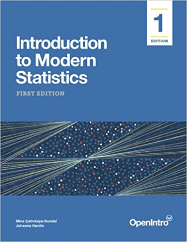

| Instructor   | Class                                                    |
|---------------------------------|---------------------------------------|
| Dr. Emily Robinson                                                                | Location: 186-C203 (Construction Innovations Ctr)                             |
| Email: [erobin17\@calpoly.edu](mailto:erobin17@calpoly.edu?subject=Stat%20218-05) | Time: Monday/Wednesday 2:10 PM - 4:00 PM                                      |
| Office: 25-103 (Faculty Offices East)                                             | Office Hours: Thursdays 2:30 PM - 4:30 PM or by Appointment [Schedule here]() |

```{r setup, include=FALSE}
# knitr::opts_chunk$set(cache=FALSE, dev='pdf')
knitr::opts_chunk$set(cache=F,
                      fig.path = 'figs/',
                      cache.path='cache/',
                      fig.align = 'center',
                      echo = F,
                      warning=F,
                      message=F)
knitr::opts_chunk$set(
                  fig.process = function(x) {
                      x2 = sub('-\\d+([.][a-z]+)$', '\\1', x)
                      if (file.rename(x, x2)) x2 else x
                      }
                  )
library(tidyverse)
library(lubridate)
# Create a calendar for your syllabus ----
# Source: http://svmiller.com/blog/2020/08/a-ggplot-calendar-for-your-semester/
# 1) what is the first Monday of the semester?
# Any number of ways to identify dates in R, but we'll use {lubridate} and the ymd() function here.
# Format: YYYYMMDD. In this example, 4 January 2022.
# What are the full dates of the semester? Here, I'll exclude exam week as I like to do.
# In this case: 6 January to 23 April
semester_dates <- seq(ymd(20220919), ymd(20221209), by=1)
# Weekday(s) of class
class_wdays <- c("Mon", "Wed")

not_here_dates <- c(
  # Labor Day
  # ymd("20220905"),
  # Veterans Day
  ymd("20221111"),
  # Spring Break
  # Fall Break
  # seq(ymd(20221017), ymd(20221018), by = 1),
  # Thanksgiving
  seq(ymd(20221121), ymd(20221125), by = 1))

# 2:10 section final Exam Dec. 9th at 1:10 - 4:00 PM
exam_dates <- c(ymd(20221012), ymd(20221109), ymd(20221209))

# 4:10 section final Exam Dec. 7th at 4:10 - 7:00 PM
# exam_dates <- c(ymd(20221005), ymd(20221105), ymd(20221207))

# project_dates <- c(ymd(20221104), ymd(20221205), ymd(20221209))
finals_week <- seq(ymd(20221205), ymd(20221209), by = 1)

# Custom function for treating the first day of the month as the first week 
# of the month up until the first Sunday 
# (unless Sunday was the start of the month)
wom <- function(date) {
    first <- wday(as.Date(paste(year(date), month(date), 1, sep = "-")))
    return((mday(date) + (first - 2)) %/% 7 + 1)
  }
# Create a data frame of dates, assign to Cal
Cal <- tibble(date = seq(ymd(20220901), ymd(20221231), by=1))  %>%
  mutate(mon = lubridate::month(date, label=T, abbr=F),
         wkdy = weekdays(date, abbreviate=T),
         wkdy = fct_relevel(wkdy, "Sun", "Mon", "Tue", "Wed", "Thu","Fri","Sat"), # make sure Sunday comes first
         semester = date %in% semester_dates, 
         # project = date %in% project_dates,
         exams = date %in% exam_dates, # is it an exam?
         not_here = date %in% not_here_dates, # is it a day off?
         exam_wk = date %in% finals_week,
         day = lubridate::mday(date), 
         week = wom(date))
Cal <- Cal %>%
  mutate(category = case_when(
    # project ~ "Project",
    exams ~ "Exam",
    not_here ~ "Cal Poly Holiday",
    semester & wkdy %in% class_wdays & !not_here & !exam_wk ~ "Class Day",
    semester ~ "Semester",
    TRUE ~ "NA"
  ))
class_cal <- Cal %>% 
  ggplot(.,aes(wkdy, week)) +
  theme_bw() +
  theme(aspect.ratio = 0.75, 
        panel.grid.major.x = element_blank(),
        legend.position = "right",
        # legend.position = c(1, 0), 
        # legend.justification = c(1,0),
        # legend.direction = "vertical", 
        legend.title = element_blank(),
        axis.title.y = element_blank(), 
        axis.title.x = element_blank(),
        axis.ticks.y = element_blank(), 
        axis.text.y = element_blank()) +
  geom_tile(alpha=0.8, aes(fill=category), color="black", size=.45) +
  facet_wrap(~mon, scales = "free", ncol=2) +
  geom_text(aes(label = day, color = semester & (!not_here))) +
  # put your y-axis down, flip it, and reverse it
  scale_y_reverse(breaks=NULL) +
  # manually fill scale colors to something you like...
  scale_color_manual(values = c("FALSE" = "grey80", "TRUE" = "black"), guide = "none") + 
  scale_fill_manual(values=c("Class Day"="purple", 
                             "Semester"="white",
                             "Cal Poly Holiday" = "grey10",
                             "NA" = "white", # I like these whited out...
                             "Exam"="orange"),
                    #... but also suppress a label for a non-class semester day
                    breaks=c("Semester", "Cal Poly Holiday", "Class Day","Exam"))
class_cal

exam_days <- filter(Cal, category == "Exam") %>%
  mutate(topic = c("Midterm Exam 1 (In Class)", "Midterm Exam 2 (In Class)", "Final Exam (1:10 - 4:00 PM)"),
         time = c("In Class", "In Class", "1:10-4:00 PM")) %>%
  rowwise() %>%
  mutate(sem_week = week(date),
         Date = paste(format(date, "%b %e"), sep = ",", collapse = ", "))

# project_days <- filter(Cal, category == "Project") %>%
#   mutate(topic = c("Project Proposal Due", "Project Presentation Due", "Project Report Due"),
#          time = c("8pm", "8pm", "8pm")) %>%
#   mutate(Date = format(date, "%b %e"),
#          sem_week = week(date))

class_days <- filter(Cal, category %in% c("Class Day")) %>%
  mutate(sem_week = week(date)) %>%
  group_by(sem_week) %>%
  # group_by(sem_week) %>%
  summarize(Date = paste(format(date, "%b %e"), sep = ",", collapse = ", ")) %>%
  mutate(topic = c(
    "Introduction to Data",
    "Quantitative Variable Exploratory Data Analysis",
    "Inference for One Mean",
    "Simple Linear Regression",
    "Difference in Means",
    "Paired Data",
    "Analysis of Variance (ANOVA)",
    "One Categorical Variable Exploratory Data Analysis",
    "One Categorical Variable Inference",
    "Two Categorical Variable Inference")) %>%
  # bind_rows(project_days) %>%
  bind_rows(exam_days) %>%
  arrange(sem_week) %>%
  select(Date, Topic = topic)
```

---

# Course Resources {.tabset .tabset-fade}

::: {.panel-tabset group="coures-resources"}

## Textbooks 

```{r, out.width = "30%"}

```

We will be using [Introduction to Modern Statistics (IMS)](https://openintro-ims.netlify.app/index.html) by Mine Çetinkaya-Rundel and Johanna Hardin, a free online text; you have the option to obtain a printed copy if you wish.

## Required Technology 

{width=15%}

{width=30%}

RStudio Cloud will be your resource for course lab assignments 

- data sets
- lab assignments
- group projects
- software resources

## Canvas

Canvas will be your resource for the course materials necessary for each week. There will be a published "coursework" page which you can access through RStudio Connect. The page will walk you through what you are expected to do each week, including:

- textbook reading
- lecture videos
- homework questions
- quiz questions

***Important***: Make sure you are receiving email notifications for *any* Canvas activity. That includes: announcements, emails, comments, etc. In Canvas, click on your name, then Notifications. Check that Canvas is using an email address that you regularly check; you have the option of registering a mobile number. Check the boxes to get notifications for announcements, content, discussions, and grades. 

## Writing & Learning Center 

There is free drop-in tutoring for 100- and 200-level math and stat courses through the writing and learning center! 

The Writing and Learning Center offers virtual and in-person tutoring appointments with four locations across campus and hours available daily Sunday thru Friday. For more information on our hours and locations, visit the [Tutoring Hours](https://writingandlearning.calpoly.edu/hours) webpage.

:::

---

# Course Description

Stat 218 is designed to engage you in the statistical investigation process from developing a research question and data collection methods to analyzing and communicating results. This course introduces basic descriptive and inferential statistics using both traditional (normal and $t$-distribution) and simulation approaches including confidence intervals and hypothesis testing on means (one-sample, two-sample, paired), proportions (one-sample, two-sample), regression and correlation. You will be exposed to numerous examples of real-world applications of statistics that are designed to help you develop a conceptual understanding of statistics. 

## Course Objectives

After taking this course, you will be able to:

+ Understand and appreciate how statistics affects your daily life and the fundamental role of statistics in all disciplines.
+ Evaluate statistics and statistical studies you encounter in your other courses.
+ Critically read news stories based on statistical studies as an informed consumer of data.
+ Assess the role of randomness and variability in different contexts.
+ Use basic methods to conduct and analyze statistical studies using statistical software.
+ Evaluate and communicate answers to the four pillars of statistical inference: How strong is the evidence of an effect? What is the size of the effect? How broadly do the conclusions apply? Can we say what caused the observed difference?

<!-- A. Design a data collection scheme based on simple random sampling or simple experimental designs. -->

<!-- B. Distinguish between observational studies and experiments and understand the limitations (practical and consequential) of each. -->

<!-- C. Summarize data using graphical and numerical techniques. -->

<!-- D. Construct and interpret confidence intervals for means and differences between means for independent and paired samples. -->

<!-- E. Conduct parametric and non-parametric two-sample hypothesis tests for means. -->

<!-- F. Construct and interpret a confidence interval for a single proportion. -->

<!-- G. Conduct Chi-square goodness-of-fit tests and tests for independence. -->

<!-- H. Distinguish between case-control and cohort studies and compute relative-risk and odds in the appropriate settings. -->

<!-- I. Perform analysis of variance tests and post-hoc comparisons for completely randomized designs. -->

<!-- J. Use simple linear regression to describe relationships between variables. -->

## GE: Mathematics / Quantitative Reasoning

This course fulfills the B4: Mathematics / Quantitative Reasoning requirement of the General Education curriculum because learning probability and statistics allows us to disentangle what's really happening in nature from “noise” inherent in data collection. STAT 218 builds critical thinking skills which form the basis of statistical inference, allowing students to evaluate claims from data. 

After completing an Area B4 course, students should be able to:

+ Calculate and interpret various descriptive statistics
+ Identify and describe data collection methods based on simple random sampling or simple experimental designs
+ Construct confidence intervals for a single mean, differences between means for independent and paired samples, a single proportion, and the difference between two proportions from independent samples, and interpret the results in the context of the life sciences
+ Formulate various decision problems in the life sciences in terms of hypothesis tests.
+ Calculate parametric hypothesis tests for the difference in two independent sample means and two independent sample proportions, Chi-square goodness-of-fit, Chi-square test for independence, and interpret the results in the context of the life sciences.
+ Calculate and interpret non-parametric hypothesis test for two independent sample means.
+ Describe relationships between two quantitative variables using simple linear regression.
 
## Prerequisites

Entrance to STAT 218 requires at least one of the following be met:

+ Grade of C- or better in MATH 115
+ Grade of B or better in MATH 96
+ appropriate placement on the 
[Math Placement Exam](https://math.calpoly.edu/mape)

You should have familiarity with computers and technology (e.g., Internet browsing, word processing, opening/saving files, converting files to PDF format, sending and receiving e-mail, etc.).

---

# Class Schedule & Topic Outline

This schedule is tentative and subject to change.

```{r calendar}
#| echo: false
#| eval: true
#| warning: false
#| fig-width: 8
#| fig-height: 4.5
class_cal
```

```{r schedule}
#| echo: false
#| eval: true
#| fig-pos: 'h'
class_days %>%
kableExtra::kable(caption = "Tentative schedule of class topics and important due dates", format = "simple")
```

# Course Policies

## Assessment/Grading

Your grade in STAT 218 will contain the following components:

```{r, echo = FALSE, warning = FALSE, message = FALSE, fig.align = "center"}

library(RColorBrewer)
pal <- brewer.pal(n = 8, name = "Greens")

grades <- tribble(
  ~category,  ~percent,
  "Reading & Videos", 0.05,
  "In-class Activities", 0.10,
  "Group Labs", 0.10,
  "Individual Assignments", 0.15,
  "Midterm Group Project", 0.10, 
  "Midterm Exams (2)", 0.20,
  "Final Group Project", 0.15,
  "Final Exam", 0.15
) %>% 
  mutate(category = factor(category, 
                           levels = c(
                             "Reading & Videos",
                             "In-class Activities",
                             "Group Labs",
                             "Individual Assignments",
                             "Midterm Group Project",
                             "Midterm Exams (2)",
                             "Final Group Project",
                             "Final Exam")
                           )
         ) %>% 
  mutate(
    location = rep(1, 8) 
  )

grades %>% 
  ggplot(aes(x = location, y = percent)) +
  geom_col(aes(fill = category), col = 'black') + 
  guides(fill = "none") + 
  geom_text(aes(x = rep(1, 8), 
                label = c(
                  "Reading & Videos (5%)",
                  "Activities (10%)",
                  "Labs (10%)",
                  "Assignments (15%)",
                  "Midterm Project (10%)",
                  "Midterm Exams (20%)",
                  "Final Project (15%)", 
                  "Final Exam (15%)"
                  ), 
                y = c(0.98, 0.90, 0.80, 0.68, 0.55, 0.40, 0.24, 0.08)
                )
            ) + 
  scale_x_discrete('', expand = c(0,0))+
  scale_y_continuous('Cumulative percent', labels = scales::percent, expand = c(0,0)) +
  theme_test() +
  theme(aspect.ratio = 0.8, axis.text.x = element_blank()) +
  scale_fill_manual(values = pal)
```

Lower bounds for grade cutoffs are shown in the following table. I will not "round up" grades at the end of the semester beyond strict mathematical rules of rounding.

| Letter grade | X +  | X   | X - |
|--------------|------|-----|-----|
| A            | 97   | 94  | 90  |
| B            | 87   | 84  | 80  |
| C            | 77   | 74  | 70  |
| D            | 67   | 64  | 61  |
| F            | \<61 |     |     |

Interpretation of this table:

-   A grade of 85 will receive a B.
-   A grade of 77 will receive a C+.
-   A grade of 70 will receive a C-.
-   Anything below a 61 will receive an F.

#### _General Evaluation Criteria_

In every assignment, discussion, and written component of this class, you are expected to demonstrate that you are intellectually engaging with the material. I will evaluate you based on this engagement, which means that technically correct but low effort answers which do not demonstrate engagement or understanding will receive no credit.

While this is not an English class, grammar and spelling are important, as is your ability to communicate technical information in writing; both of these criteria will be used in addition to assignment-specific rubrics to evaluate your work.

## Course Organization

### Communication

Course material will be posted in Canvas modules and announcements will be used to let you know what is due over the next week.

We will use Canvas discussion boards to manage questions and responses regarding course content. There are discussion forums for the different components of each week (e.g., Week 1 Lab). Please __do not__ send me an email about homework questions or questions about the course material. It is incredibly helpful for others in the course to see the questions you have and the responses to those questions. If you think you can answer another student’s question, please respond! 

You can expect me to reply to emails within 48 hours during the week (72 hours on weekends). If you don't hear back from me in this time span, assume I did not receive your email and resend it!

### Assessment Breakdown

::: {.panel-tabset group="coures-resources"}

#### Reading & Videos (5%)

You will be expected to complete the assigned textbook reading and course videos prior to attending class each week. As you complete the reading and watch the videos, you should complete the concept check quiz questions. You can retake the video quizzes as many times as you like (the most recent grade will be recorded in Canvas) until the deadline.

* Concept check quizzes are due **Monday at 8pm Pacific Time each week**.
* The two lowest concept check quiz grades will be dropped.

#### In-class Activities (10%)

Monday's classes will be dedicated to meeting with your classmates and instructor to work through that week's group activity. Attendance and completion of the activity counts towards this portion of your grade. 

* Printed activities will be provided for you on Monday, with Word and PDF files posted on Canvas
* Activities will be checked for completion at the **beginning of class on Wednesday.** 
* If you have an excused absence the day the activity is due (e.g., quarantine or ill), you may email me a scanned copy of the completed activity for credit. This must be received by **8pm Pacific Time on the day the activity would be checked in class**.
* The lowest activity grade will be dropped.

#### Group Labs (10%)

Every Wednesday, you will meet with your classmates and instructor to work through that week's Rstudio Cloud group lab. The lab will reinforce the ideas learned in the activities completed Monday, through the use of R to explore and analyze data.  

* Each group will turn in selected questions from the lab to Canvas. Labs are due **Friday at 8pm Pacific Time each week**.
* Each individual student will also turn in the entirety of each lab for completion at the **beginning of class on Monday**.
* The lowest lab grade will be dropped.

#### Individual Assignments (15%)

You will complete weekly assignments in **Canvas**. These should be completed **individually** (meaning all answers should be written in your own words), but you may use your classmates, tutors, or your instructor for assistance. 

* Weekly assignments are due **Sunday at 8pm Pacific Time each week**.
* The lowest assignment grade will be dropped.

### Midterm & Final Projects (25%)

There will be two projects throughout the quarter, where you will be asked to apply the statistical concepts you have learned in the context of real data. Each of these projects will be done in the teams you have been working with in class. More details will be provided during class.

#### Midterm exams (20%)

There will be one midterm exam (worth 15% of the course grade). The midterm exam will be taken in class during your normal in-class time. Each exam has a group (Wednesday) and individual (Friday) component.  A practice exam will be released in Canvas one week prior to the exam, with solutions to the practice exam released in Canvas the Friday prior to the exam. Further details, resources, and instructions for each exam will be posted the week prior to the exam in Canvas.

##### _Group portion_:

Group midterm exam 1 will be: **Wednesday, April 27**  

Group midterm exam 2 will be: **Wednesday, May 18**

* Group portions of the midterms are worth 20% of your midterm exam grade.
* Group midterm exams are open book, open notes. 
* You will be allowed a calculator on the group midterm exams. 
* You **will** be required to use Rstudio on the group midterm exams.
* **If you miss more than 25% of class days within a unit without communicating with your section instructor and group-mates, you must complete the group exam individually.**

##### _Individual portion_:

Individual midterm exam 1 will be: **Tuesday, April 26th**  

Individual midterm exam 2 will be: **Tuesday, May 17th**

* Individual portions of the midterms will be worth 80% of your midterm exam
grade.
* Potential individual midterm exam questions will be released one week prior to
the exam. 
* Individual midterm exams are open notes. 
* A formula sheet will be provided to use during the exam (also released with
the potential midterm exam questions).
* You will be allowed a calculator on the individual midterm exams. 
* You will **not** be required to use Rstudio on the individual midterm exams.

#### Final exam (15%)

The group final exam will be taken in class during your normal in-class time. A practice exam will be released in Canvas one week prior to the exam, with solutions to the practice exam released in Canvas the Wednesday prior to the exam. Further details, resources, and instructions for each exam will be posted the week prior to the exam in Canvas.

##### _Group portion_:

Group final exam will be **Wednesday, June 1st (during normal class time)**. 

* The group portion of the final exam will be worth 20% of your exam grade.
* The group final exams is open book, open notes. 
* You will be allowed a calculator on the group final exam. 
* You **will** be required to use Rstudio on the group final exam.
* **If you miss more than 25% of class days in Unit 3 without communicating with your section instructor and group-mates, you must complete the group exam individually.**

##### _Individual portion_:

Individual final exam will be: **Saturday, June 4, from 10:10am – 1:00pm in 180-0107.** 

* The individual portion of the final exam will be worth 80% of your exam grade.
* Potential final exam questions will be released on Monday, May 30.
* The individual final exam is closed book. 
* You will be provided a one page formula sheet during the exam.
* You will be allowed a calculator on the individual final exam. 
* You will **not** be required to use Rstudio on the individual final exams.

:::

### Working in Teams 

Working in teams is beneficial for *every* student, but only if each person meaningfully engages in the discussions being had. Each of you will work in a group of 2-3 students to discuss the course concepts and complete the course activities and labs. 

To ensure the group's work is divided equitably each week, your team will be rotating through a set of group roles. This ensures one person doesn't act as the group leader for multiple sessions of class, while someone else is always the note taker. You will circulate through the following roles each week:


|  Role         | Responsibilities | 
|---------------|------------------|
| Manager | Responsible for organizing the team work: making sure all roles were assigned and clear, leading discussion of the activity or lab assignment problems. |
| Recorder | Responsible for collecting, organizing, and recording answers to the assignment during the discussions, compiling the summary of the answers discussed, sending summary to Editor. |
| Editor | During the group discussions the editor is responsible for making sure everyone has a chance to contribute, asking quiet team members to speak up, asking loud team members to listen to others, and bringing the conversation back to the lab assignment if it deviates. The Editor is also responsible for reviewing the draft summary provided by the Recorder, sharing the summary with the team, soliciting feedback from the team, and submitting the final assignment by the deadline.|

If you are in a group of two, the *Manager* also acts as the *Editor*, and is expected to both organize the team work, lead the discussion, and review the draft summary prepared by the Recorder.

#### _Team Meetings_

There will be time in each class for your team to work on the assignment for the week, however this time will not be sufficient to complete the assignments. Therefore, every group is expected to meet for at least 1-hour outside of class. 

__If you are not in attendance for *more than one* of your team meetings that week, you will be expected to complete that week's activity and lab on your own.__ 

<!-- My hope is that each member of the group looks over the week's assignment on Monday while reading the week's chapter(s). Then, each member should have a  solid understanding of the content by Tuesday's activity. During Tuesday's activity and Wednesday's lab, the Team Manager is tasked with leading the -->
<!-- discussion of the activity. The Reporter is tasked with recording the ideas shared by the team. The editor is tasked with ensuring each team member has the opportunity to share and, following the class meeting, is in charge of reviewing the draft submitted by the Recorder.  -->

<!-- As a team, you can choose to work together or independently on the assignment's problems between course meetings. The Manager is responsible for scheduling additional meetings, so that the Editor is able to submit the assignment on time.  -->

## Late Policy

**Individual Assignments**

Assignments are expected to be submitted on time. However, every student will be permitted to submit **one** individual assignment 24 hours late without question. You do not need to contact me to use this allowance, but I will be keeping track of when you use your allowance.

Any additional late assignments will be accepted only under extenuating circumstances, and only if you have contacted me **prior** to the assignment due date and received permission to hand the assignment in late. I reserve the right not to grade any additional assignments received after the assignment due date.

**Exams**: 

+ Students that are in quarantine but healthy enough to take the exam should email me to arrange to take the exam at home while being proctored via Zoom.

+ If you are ill to the point of not being able to take the exam, please email me to arrange a time to take the exam remotely via Zoom when you are feeling better within the week of the exam.

+ Students who miss the exam without contacting me prior to the exam will receive a zero on the exam.

+ Work is not a legitimate reason for an exam absence.

## Attendance

You are expected to attend class and participate in the week's team collaboration in a timely manner. If you find that you are unable to participate in the week's team collaborations, __please let your team know and contact me__. Consistent, repeated failure to attend class or actively participate in the online portions of the course will affect the participation portion of your grade.

If you are feeling ill, please **do not come to class**. Instead, please email myself and group-mates letting them know **prior to the class meeting**. Review the material and work on the homework assignment, and then schedule an appointment with me to meet virtually.

## Expectations

You can expect me to:

+   reply to emails within 48 hours during the week (72 hours on weekends)
+   be available in class to assist with assignments
+   be available by appointment for additional help or discussion

I expect you to:

+   Read the textbook material and watch any videos before coming to class
+   Engage with the material and your classmates during class
+   Seek help when you do not understand the material
+   Communicate promptly if you anticipate that you will have trouble meeting deadlines or participating in a portion of the course.
+   Be respectful and considerate of everyone in the class

---

# Required University Information

See [academicprograms.calpoly.edu/content/academicpolicies](https://academicprograms.calpoly.edu/content/academicpolicies/index).

## Academic Integrity and Class Conduct

You will be engaging with your classmates and me through in-person discussions, zoom meetings, and collaborative activities. It is expected that everyone will engage in these interactions civilly and in good faith. Discussion and disagreement are important parts of the learning process, but it is important that mutual respect prevail. Individuals who detract from an atmosphere of civility and respect will be removed from the conversation.

Students are expected to adhere to the following responsibilities concerning academic dishonesty:

1. consult and analyze sources that are relevant to the topic of inquiry;

2. acknowledge when they draw from the ideas or the phrasing of those sources in their own writing;

3. learn and use appropriate citation conventions within the field in which they are studying; and

4. ask their instructor for guidance when they are uncertain of how to acknowledge the contributions of others in their thinking and writing.

When students fail to adhere to these responsibilities, they may intentionally or unintentionally "use someone else’s language, ideas, or other original (not common-knowledge) material without properly acknowledging its source" [http://www.wpacouncil.org](http://www.wpacouncil.org). When the act is intentional, the student has engaged in plagiarism.

Plagiarism is an act of academic misconduct, which carries with it consequences including, but not limited to, receiving a course grade of “F” and a report to the Office of the Dean of Students. Unfortunately, it is not always clear if the misuse of sources is intentional or unintentional, which means that you may be accused of plagiarism even if you do not intentionally plagiarize. If you have any questions regarding use and citation of sources in your academic writing, you are responsible for consulting with your instructor before the assignment due date. In addition, you can work with an Writing Center tutor at any point in your writing process, including when you are integrating or citing sources.

**In STAT 218, students involved in plagiarism on assignments (all parties involved) will receive a zero grade on that assignment. The second offense will result in a zero on that assignment, and the incident will be reported to the Office of Students Rights and Responsibilities. Academic misconduct on an exam will result in a zero on that exam and will be reported to the Dean of Students, without exception.**

## Policy on intellectual property

This syllabus, course lectures and presentations, and any course materials provided throughout this term are protected by U.S. copyright laws.  Students enrolled in the course may use them for their own research and educational purposes.  However, reproducing, selling or otherwise distributing these materials without written permission of the copyright owner is expressly prohibited, including providing materials to commercial platforms such as Chegg or CourseHero.  Doing so may constitute a violation of U.S. copyright law as well as Cal Poly’s Code of Student Conduct.

