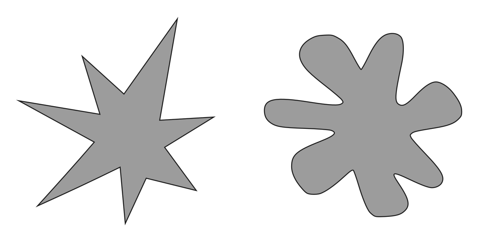
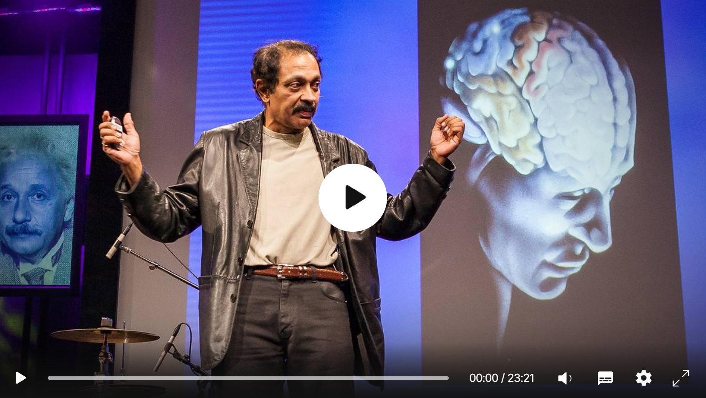
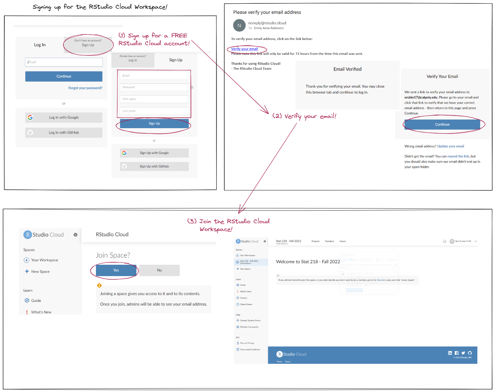
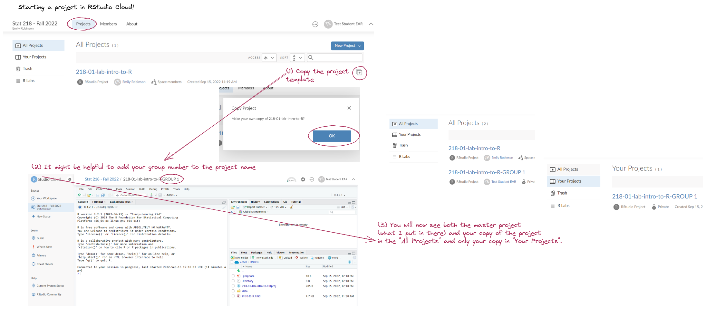
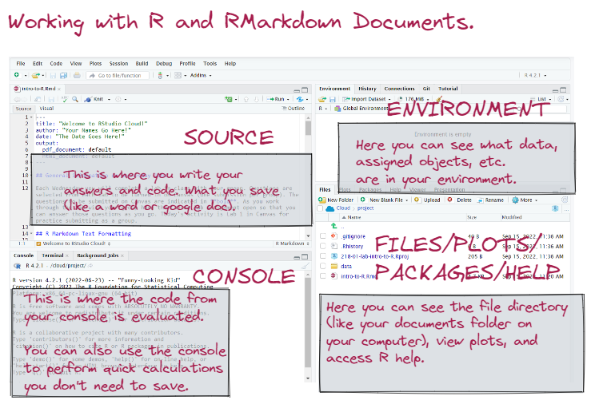
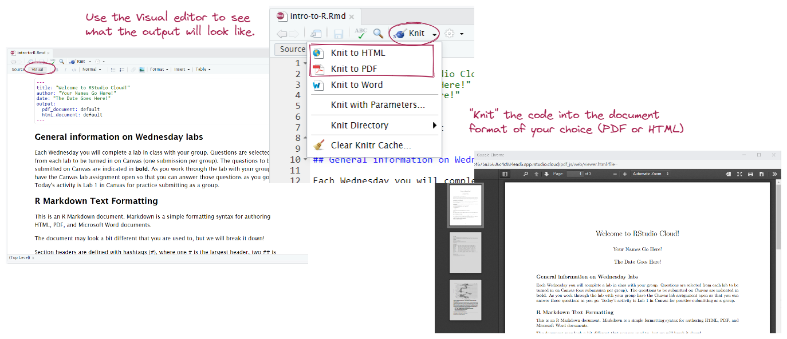
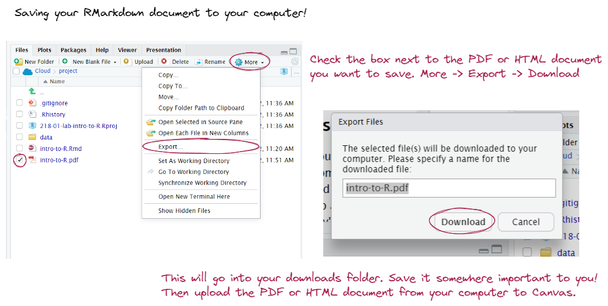
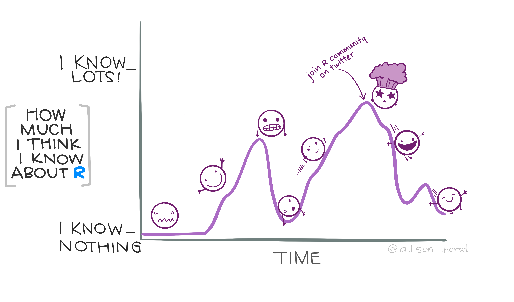

class:title-slide-custom

<style>
p.caption {
  font-size: 0.8em;
}
</style>

```{r, child = "style.Rmd"}
```


```{r setup, echo = FALSE, message = FALSE, warning = FALSE}

# Packages
library(emoji)
library(tidyverse)
library(gridExtra)
library(scales)
library(knitr)
library(kableExtra)
library(iconr)
library(fontawesome)
library(readr)
library(patchwork)

# R markdown options
knitr::opts_chunk$set(echo = FALSE, 
                      message = FALSE, 
                      warning = FALSE, 
                      cache = FALSE,
                      fig.align = 'center',
                      dpi = 300)
options(htmltools.dir.version = FALSE)
options(knitr.kable.NA = '')
```

```{r, include = F, eval = T, cache = F}
clean_file_name <- function(x) {
  basename(x) %>% str_remove("\\..*?$") %>% str_remove_all("[^[A-z0-9_]]")
}
img_modal <- function(src, alt = "", id = clean_file_name(src), other = "") {
  
  other_arg <- paste0("'", as.character(other), "'") %>%
    paste(names(other), ., sep = "=") %>%
    paste(collapse = " ")
  
  js <- glue::glue("<script>
        /* Get the modal*/
          var modal{id} = document.getElementById('modal{id}');
        /* Get the image and insert it inside the modal - use its 'alt' text as a caption*/
          var img{id} = document.getElementById('img{id}');
          var modalImg{id} = document.getElementById('imgmodal{id}');
          var captionText{id} = document.getElementById('caption{id}');
          img{id}.onclick = function(){{
            modal{id}.style.display = 'block';
            modalImg{id}.src = this.src;
            captionText{id}.innerHTML = this.alt;
          }}
          /* When the user clicks on the modalImg, close it*/
          modalImg{id}.onclick = function() {{
            modal{id}.style.display = 'none';
          }}
</script>")
  
  html <- glue::glue(
     " <!-- Trigger the Modal -->

<!-- The Modal -->
<div id='modal{id}' class='modal'>
  <!-- Modal Content (The Image) -->
  
  <!-- Modal Caption (Image Text) -->
  <div id='caption{id}' class='modal-caption'></div>
</div>
"
  )
  write(js, file = "js-addins.html", append = T)
  return(html)
}
# Clean the file out at the start of the compilation
write("", file = "js-addins.html")
```

<br><br>
# INTRODUCTION TO DATA & STATISTICAL INFERENCE
## Stat 218: Applied Statistics for the Life Sceinces
#### Dr. Emily Robinson 
#### California Polytechnic State University - San Luis Obispo
<!-- ##### `r fa("github", fill = "black")` [Course GitHub Webpage](https://earobinson95.github.io/stat218-calpoly) -->

---
class:inverse
# MONDAY, SEPTEMBER 19, 2022

 Today we will...

`r fa_i("door-open")` Welcome to Stat 218 (Applied Statistics for the Life Sciences)

`r fa_i("hand")` Introductions

`r fa_i("file")` Syllabus

`r fa_i("chart-line")` What is Data & Statistics?

`r fa_i("comment")` Activity 1: Martian Alphabet

---
class:primary
# INTRODUCTIONS

Please share the following:

+ First and last name (and what you want to be called in class)
+ Preferred pronouns
+ Major
+ Favorite comfort food or your go to hobby

---
class:primary
# SYLLABUS
<br><br><br>
...because who doesn't love syllabus week?

---
class: center, middle, inverse
# DATA & STATISTICS

---
class:primary
# WHAT IS DATA?

+ Data are plain facts, usually raw numbers.
+ Collected on observational units.
+ Can be in the form of counts, measurements, or responses.

Why do we need data? Why is proper *collection*, *analysis*, and *interpretation* of data important?

---
class:primary
# TIDY DATA

```{r, fig.alt = "Stylized text providing an overview of Tidy Data. The top reads “Tidy data is a standard way of mapping the meaning of a dataset to its structure. - Hadley Wickham.” On the left reads “In tidy data: each variable forms a column; each observation forms a row; each cell is a single measurement.” There is an example table on the lower right with columns ‘id’, ‘name’ and ‘color’ with observations for different cats, illustrating tidy data structure.", out.width = "70%"}
knitr::include_graphics("images/tidydata_1.jpg")
```

.medium[Illustrations from the [Openscapes](https://www.openscapes.org/) blog [Tidy Data for reproducibility, efficiency, and collaboration](https://www.openscapes.org/blog/2020/10/12/tidy-data/) by Julia Lowndes and Allison Horst]

---
class:primary
# TIDY DATA

```{r, fig.alt = "", out.width = "100%"}
knitr::include_graphics("images/tidy_data.png")
```

---
class:primary
# WHAT IS STATISTICS?

**Statistics** is the study of how best to *collect*, *analyze*, and *draw conclusions* from data.

To me...

+ statisitics is the best tool we have to understand uncertainty;
+ helps us make educated guesses about the unknown in the ocean of data;
+ the propper application of statistical methods is crucial in most if not all of the steps of the scientific method.

Where are statistics used?

---
class:primary
# BRANCHES OF STATISTICS

.pull-left[**Descriptive Statistics**

are methods that describe, show, or summarize the data from our sample in a meaningful way.

.center[
```{r results='asis'}
i1 <- img_modal(src = "images/descriptive-statistics.jpg", alt = " ", other=list(width="25%"))

c(str_split(i1, "\\n", simplify = T)[1:2],
  str_split(i1, "\\n", simplify = T)[3:9]
  ) %>% paste(collapse = "\n") %>% cat()
```
]

.medium[Illustrations by [luminousmen.com](https://luminousmen.com/post/descriptive-and-inferential-statistics)]


].pull-right[

**Inferential Statistics**

are methods that allow us to draw conclusions about the larger population that the sample represents.

.center[
```{r results='asis'}
i1 <- img_modal(src = "images/inferential-statistics.png", alt = " ", other=list(width="60%"))

c(str_split(i1, "\\n", simplify = T)[1:2],
  str_split(i1, "\\n", simplify = T)[3:9]
  ) %>% paste(collapse = "\n") %>% cat()
```
]

]

---
class: center, middle, inverse
# TAKE A BREAK TO STRETCH

---
class:primary
# ACTIVITY 1:  MARTIAN ALPHABET

```{r, out.width = "70%"}

```

---
class: primary
# ACTIVITY 1 REGROUP

So what do you think? Are we good at speaking Martian?

---
class: primary
# TED Talk

[3 Clues to Understanding Your Brain](https://www.ted.com/talks/vs_ramachandran_3_clues_to_understanding_your_brain) by Vilayanur Ramachandran (2007).

```{r, fig.cap = "", fig.alt = "Image of a man giving a TED talk.", out.width = "70%"}

```

---
class:primary
# TO DO

+ Complete Activity 1: Martian Alphabet
  + *check during class Wednesday, 9/21*
+ Week 1 Reading Guide (Ch. 1 & 2)
  + *read before class Wednesday, 9/21*
  + *no associated concept check quiz*
+ Stat 218 Community & Syllabus Concept Check Quizzes
  + *due Wednesday, 9/21, at 8pm*

---
class: inverse
# WEDNESDAY, SEPTEMBER 21, 2022

 Today we will...

`r fa_i("people-group")` Meet your group mates!

`r fa_i("check")` Check *Activity 1: Martian Alphabet*

`r fa_i("hand")` Introduce Instructional Student Assistant

`r fa_i("computer")` Set up RStudio Cloud & Introduction to R

`r fa_i("code")` Lab 1: Welcome to RStudio Cloud!

`r fa_i("list")` Beginning your midterm project

---
class: primary
# GET INTO YOUR GROUPS

+ Introduce yourselves again (with year + major)

+ Determine a form of communication and send your name to each other (email, canvas, phone, slack, etc.)

+ Select a 1 hour time slot you could meet each week and put "placeholders" on your calendar.
  + Keep in mind group lab questions are due at 8pm on Fridays.
  + Most times you will be able to complete this during class.
  
+ How will you meet (Zoom, library study room, etc)?

---
class:primary
# Lab 1: Welcome to RStudio Cloud!

```{r, fig.cap = "", fig.alt = "Image of a man giving a TED talk.", out.width = "60%"}

```

---
class:primary
# Lab 1: Welcome to RStudio Cloud!

```{r, fig.cap = "", fig.alt = "Image of a man giving a TED talk.", out.width = "100%"}

```

---
class:primary
# INTRODUCITON TO R

```{r, fig.cap = "", fig.alt = "Image of a man giving a TED talk.", out.width = "70%"}

```

---
class:primary
# RMARKDOWN (RMD) DOCUMENTS

```{r, fig.alt = "Two fuzzy round monsters dressed as wizards, working together to brew different things together from a pantry (code, text, figures, etc.) in a cauldron labeled “R Markdown”. The monster wizard at the cauldron is reading a recipe that includes steps “1. Add text. 2. Add code. 3. Knit. 4. (magic) 5. Celebrate perceived wizardry.” The R Markdown potion then travels through a tube, and is converted to markdown by a monster on a broom with a magic wand, and eventually converted to an output by pandoc. Stylized text (in a font similar to Harry Potter) reads 'R Markdown. Text. Code. Output. Get it together, people.'", out.width = "65%"}
knitr::include_graphics("images/rmarkdown_wizards.png")
```

.medium[Illustrations by [Allison Horst](https://www.allisonhorst.com/)]

---
class:primary
# RMARKDOWN (RMD) DOCUMENTS

```{r, fig.cap = "", fig.alt = "Image of a man giving a TED talk.", out.width = "100%"}

```

---
class:primary
# EXPORTING YOUR LAB DOCUMENTS

```{r, fig.cap = "", fig.alt = "Image of a man giving a TED talk.", out.width = "100%"}

```

---
class:primary
# R KNOWLEDGE ROLLERCOASTER

```{r, fig.alt = "An illustrated cartoon graph with “How much I think I know about R” on the y-axis, with axis labels at “I know nothing” and “I know lots”, versus “time” on the x-axis. The line varies widely between the two. Above the line are emoji-like faces, showing uncertainty and hope early on. At a second peak is the label “join R community on twitter”, with a “mind-blown” emoji face. The line quickly descends, but with a happy looking emoji character sliding down it.", out.width = "70%"}

```

.medium[Illustrations by [Allison Horst](https://www.allisonhorst.com/)]

---
class:primary
# BEGINNING YOUR MIDTERM PROJECT

Over the next five weeks, you will slowly put together the pieces of your midterm project. The first step is to find a data set.

This week you are tasked with exploring the [CORGIS (The Collection of Really Great, Interesting, Situated Data sets)](https://corgis-edu.github.io/corgis/csv/) website and finding a data set that interests you.

There are only two qualifications for the data set:

+ The data set must have two numerical variables.
+ The data set must be interesting to you!

It is great if you find a data set that also has one (or two) categorical variables, but that is not required.

---
class:primary
# TO DO

+ Stat 218 Community & Syllabus Concept Check Quizzes 
  + *due TONIGHT, 9/21, at 8pm*
+ Lab 1: Welcome to RStudio Cloud
  + *selected questions: due Friday, 9/22 at 8pm*
  + *completion: due Monday, 9/26 at 2pm* 
+ Midterm Project: Part 1 (aka Assignment 1)
  + *due Sunday, 9/25 at 8pm*
+ Week 2: Reading Guide (Chapter 5)
  + *concept check quizzes due Monday, 9/26 at 2pm*
