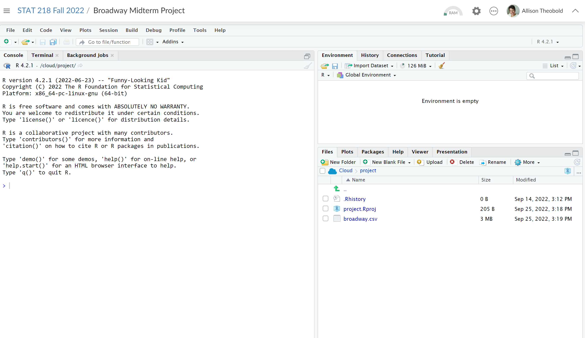

# Prompt

For this part of the project you will do three things:

1. Create a new project in the course workspace on RStudio Cloud
2. Download your selected dataset as a .csv file (the one you submitted here: Midterm Project: Part 1)
3. Upload your data to your RStudio Cloud Project
 

I've recorded a video walking you through this process: VIDEO LINK HERE!

You are to submit a screenshot, showing both your RStudio Cloud project and your uploaded data file. 

```{r, fig.align = 'center'}

```


# Feedback


#### If they properly created a project in the course workspace and uploaded the csv file (5 pts)

This all looks great :) I am excited to watch your midterm project develop!


#### If they loaded the data set into R using read_csv(LINK TO URL) (5 pts)

Nice job looking up how to read a data set in from a url! 
I was going to have you all upload your .csv files to the project directory, but if you wish to load the data this way instead, 
please make sure to save this code into the Rmd file for this week so you can replicate this and load the data set in each time.


#### If they created the project in their own workspace and not the class workspace (4.5 pts)

Is this project created in the Stat 218 - Fall 2022 Workspace? I don't see it in there so you may have created it in your own workspace. 
If it is in the course workspace, I will be able to go in to see the project and code when you have questions while completing the midterm.
Please move/create your project within the course work space.


#### If they didn't properly upload the data set (4 pts)

Check your data download format. It seems to have lost the .csv extension and will have issues reading in properly.


#### If you can not see the format of their image (0 pts to be changed once properly uploaded)

I cannot see the format of the image or file. Can you upload a .png, .jpeg, .jpg? Once a visible format is uploaded, you will recieve credit.