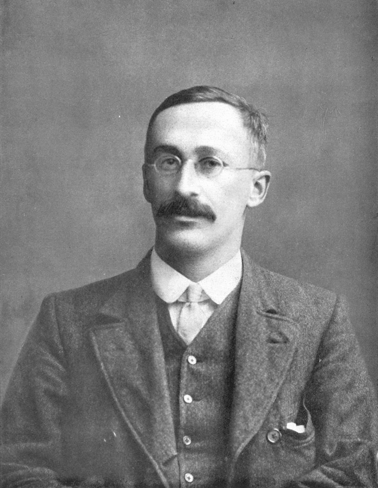

```{r setup, include = FALSE}
library(tidyverse)
library(mosaic)
library(infer)

set.seed(1234)

my_theme <- theme(axis.text = element_text(size = 16), 
                  axis.title = element_text(size = 18)
                  ) +
  theme_bw()
```

```{r data, include = F}
# sleep_hours <- rnorm(n = 50, 
#                      mean = 6.8, 
#                      sd = 1) %>% 
#   tibble::tibble(hours = .) %>% 
#   mutate(student = row_number(.), 
#          hours = case_when(hours <= 4 ~ 4,
#                            between(hours, 4.01, 4.5) ~ 4.5,
#                            between(hours, 4.501, 4.99) ~ 5, 
#                            between(hours, 5, 5.499) ~ 5.5,
#                            between(hours, 5.5, 5.9) ~ 6, 
#                            between(hours, 6, 6.49) ~ 6.5, 
#                            between(hours, 6.5, 6.99) ~ 7, 
#                            between(hours, 7, 7.49) ~ 7.5, 
#                            between(hours, 7.5, 7.99) ~ 8, 
#                            between(hours, 8, 8.49) ~ 8.5, 
#                            hours >= 8.5 ~ 9
#                            ), 
#          hours = replace_na(hours, replace = 6.5)
#          ) %>% 
#   arrange(student)

#write_csv(sleep_hours, "sleep_hours.csv")

sleep_hours <- read_csv("sleep_hours.csv")

```


# Part 0: Setup

## Step 1: Research Question

For any statistical investigation, we need to start with a research question we are interested in studying. For this activity, we will consider how much do STAT 218 students sleep on a typical night? Let’s make the question more clear:
Is the average number of hours of sleep for any given night less than the recommended eight hours? 


**1. Based on the research question, what is the observational unit, the population of interest, the variable of interest, and the parameter (and symbol)?**

- Observational Unit:

\vspace{0.2in}

- Population of interest:

\vspace{0.2in}

- Variable of interest:

\vspace{0.2in}

- Parameter (in words and assign symbol):

\vspace{0.2in}

## Step 2: Design a Study & Collect Data

We will investigate whether the mean amount of sleep last night for the population of all STAT 218 students was less than 8 hours. 

\vspace{0.1in}

### Null and Alternative Hypotheses:

$H_o$: The population mean hours of sleep for all 218 students is 8 hours. 

$H_a$: The population mean hours of sleep for all 218 students is less than 8 hours.

**2. How would you write these hypotheses using symbol notation instead of words?**

$H_o$:

\vspace{0.1in}

$H_a$:

\vspace{0.1in}

To test these hypotheses, we need to collect data. Ideally a simple random sample should be collected in order to avoid bias in our sampling method. However, this would take a fair bit of work. 

**3. Two sections of STAT 218 were randomly selected out of all of the sections of STAT 218 to obtain 50 STAT 218 students. What type of sampling method could this be?**

\vspace{0.2in}

This method of sampling could be biased in some form. We will revisit the implications of using two classes as a sample of STAT 218 students later when we evaluate the study. For now, let’s consider our results.

## Step 3: Exploratory Data Analysis (EDA)

After your data are collected, the next step is to explore them! In the case of a quantitative variable exploring the data consists of visualizing the distribution of the responses and calculating summary statistics, to describe the shape, center, variability, and unusual observations. 

The histogram and the statistical measures below summarize the distribution of sleep hours for the 50 sampled STAT 218 students.

```{r, eval = FALSE}
ggplot(data = sleep_hours, 
       mapping = aes(x = hours)) +
  geom_histogram() +
  labs(x = "Hours Slept in Sample of 50 STAT 218 Students", 
       y = "Number of Students")

```

```{r eda, warning = FALSE, echo = FALSE, message = FALSE}
ggplot(data = sleep_hours, aes(x = hours)) +
  geom_histogram(binwidth = 0.25, color = "white", fill = "steelblue") +
  labs(x = "Hours Slept", 
       y = "Number of Students") + 
  my_theme + 
  scale_x_continuous(breaks = seq(4.5, 9, by = 0.5)) +
  scale_y_continuous(breaks = seq(0,10,2)) +
  ggtitle("Sleepless Nights \n (Sample of 50 Stat 218 Students)")
```

\vspace{0.1in}


```{r}
favstats(~ hours, data = sleep_hours)
```

\vspace{0.1in}

**4. Describe the distribution of the sample above.**

+ Center:
+ Variability:
+ Shape:
+ Outliers:

## Step 4: Draw inferences beyond the data

Now that we have explored the data and better understand the distribution of sleep hours for the sample of STAT 218 students, we will use both simulation and theory-based approaches to evaluate the claim that STAT 218 students get less than the recommended amount of sleep they should (8 hours). 

We will use two different statistical methods to evaluate the evidence our data provide: 

1. Simulation
2. Mathematical Theory

# Part 1: Simulation-Based Approach

To evaluate how much evidence our data provide against the null hypothesis, we need to know what means we could expect from other samples of STAT 218 students!

#### Statistic 

The first step is to remind yourself of the average number of hours of sleep for the sample of STAT 218 students (this is our observed statistic or point estimate). 

**5. $\bar{x}=$**

\vspace{0.1in}

#### One Simulation

To know what other means we could expect to get from a different sample of STAT 218 students we will use **bootstrapping**. A "bootstrap" is a method of resampling from the original sample to obtain a "new" sample. 

For boostrapping, the **critical** assumption we are making is that the students in our original sample are "representative" of the population of STAT 218 students. If this is true, then we can view each resample as similar to another sample that we could have gotten when sampling from the entire population. 

You have been given a bag of 50 cards, where each card has the observed number of hours slept for a STAT 218 student. 

\vspace{0.1in}

**6. Your team should resample (with replacement) 50 cards from the bag, writing down each number before putting the card back in. Once you have 50 values, find the mean number of hours slept in your resample.**

$\bar{x}_{bs}=$


\vspace{0.2in}


**7. Plot the bootstrap means other groups obtained.**


\vspace{0.5in}


#### Thousands of Simulations

Alright, you obtained one resample, but getting 100 resamples using our card method would take us a long time (and would be really boring). So, we will use the computer, specifically `R`, to help us get bootstrap resamples much quicker!

To obtain a boostrap resample, we have a three step process:

1. `specify` what the response variable is
2. `generate` ____ boostrap resamples
3. `calculate` the mean for each bootstrap resample

The code below does that for us and saves them in a new data set called `bootstrap_resamples`:

```{r, eval = FALSE}
bootstrap_resamples <- sleep_hours %>%
  specify(response = hours) %>% 
  generate(reps = 10, type = "bootstrap") %>% 
  calculate(stat = "mean")

head(bootstrap_resamples)
```

Here is a preview of what these bootstrap resamples look like:

```{r, echo = F, messages = F, warnings = F}

set.seed(68507)

bootstrap_resamples <- sleep_hours %>%
  specify(response = hours) %>% 
  generate(reps = 10, type = "bootstrap") %>% 
  calculate(stat = "mean")

bootstrap_resamples %>% knitr::kable()
```

**8. What does the `replicate` column correspond to?**

\vspace{0.2in}

**9. What does the `stat` column correspond to?**

\vspace{0.2in}

**10. Of these 10 resamples, what is the smallest mean that was obtained? What was the largest mean that was obtained?**

\vspace{0.2in}

**11. If you were to make a histogram or a dotplot of these 10 means, where do you believe it would be centered?**

#### Bootstrap Distribution

Alright, to get a good idea of what means we might get from other samples, we will obtain lots of bootstrap resamples. Typically, we will use *at least* 1,000 resamples, so we get a good idea of what the distribution of the boostrap
statistics looks like. 

The distribution of bootstrap statistics (in this case means) has a specific name. We call this the **bootstrap distribution**. I've run the code to obtain 1,000 bootstrap resamples and plotted the results in the histogram below. 

```{r, echo = FALSE}
bootstrap_resamples <- sleep_hours %>%
  specify(response = hours) %>% 
  generate(reps = 10000, type = "bootstrap") %>% 
  calculate(stat = "mean") 

bootstrap_resamples %>%
  ggplot(aes(x = stat)) +
  geom_histogram(color = "white", fill = "gray", binwidth = 0.05) +
  # visualize(method = "simulation") +
  labs(x = "", 
       y = "", 
       title = "") + 
  my_theme +
  scale_x_continuous(breaks = seq(4,9,0.1)) +
  scale_y_continuous(breaks = seq(0,2000,200)) +
  ggtitle("Bootstrap Distribution \n(B = 1000)")
```

\vspace{0.05in}

**12. Fill in the x-axis and y-axis labels for the bootstrap distribution above.**

\vspace{0.05in}

**13. How would you describe the shape of the distribution?**

\vspace{0.2in}

**14. Where is the distribution centered? Why do you believe it is centered there?**

\vspace{0.2in}

### Step 5: Making Conclusions

We use a bootstrap distribution to see the variability in the statistics we might have seen from other samples from the population. These different statistics give us an idea as to where we believe the population parameter might lie. 

**15. What is the population parameter we are trying to estimate?** *Hint: Look back at Question 1*

\vspace{0.2in}

There are two ways to obtain a confidence interval, (1) using the "percentile" method and (2) using the "SE" method. 

The percentile method uses percentiles to decide the endpoints of the interval. I've provided a table of different percentiles to help you create your confidence interval. 

```{r, echo = FALSE}
bootstrap_resamples %>% 
  summarize("0.5%" = quantile(stat, 0.05), 
            "1%" = quantile(stat, 0.01),
            "2.5%" = quantile(stat, 0.025),
            "5%" = quantile(stat, 0.05),
            "90%" = quantile(stat, 0.90),
            "95%" = quantile(stat, 0.95),
            "97.5%" = quantile(stat, 0.975),
            "99.5%" = quantile(stat, 0.95)
            ) %>% 
  pivot_longer(cols = everything(), 
               names_to = "Quantile", 
               values_to = "Value") %>% 
  knitr::kable()
```

\vspace{0.1in}

**16. Suppose we are interested in constructing a 95% confidence interval. Using  the table above, report the end points of this confidence interval.**

\vspace{0.2in}

**17. Interpret the confidence interval in the context of this investigation.**

\vspace{0.2in}

**18. Given the values of your 95% confidence interval, do you believe it is reasonable to assume that STAT 218 students get 8 hours of sleep? Why or why not?**

\vspace{0.2in}


# Part 2: Theory based approach (aka mathematical SE method)

In the previous part, we explored utilizing a bootstrap distribution to obtain a confidence interval for the population mean. There is another approach we could have used instead, which focuses on mathematical formulas and not simulation. 

These "theory-based" mathematical formulas have a similar idea: 

    *Obtain a distribution of statistics we might have expected from other samples.*

This distribution has a special name, it is called a **sampling distribution**. A sampling distribution is a *distribution of statistics* calculated for different samples. This week, we are focusing on the mean. So, our sampling 
distribution will visualize the variability in sample means we would expect from other samples. 

In the previous part, we created a sampling distribution using bootstrapping. We resampled from our original data to create "new" samples we could have expected to obtain from other samples of STAT 218 students. In this part, we will instead use mathematical theory to obtain our sampling distribution. 

## Central Limit Theorem (CLT)

This key theorem in Statistics says that when we collect a "sufficiently large" sample of $n$ **independent** observations from a population with mean $\mu$ and standard deviation $\sigma,$ we know the **sampling distribution** of $\bar{x}$ will be nearly Normal with mean $\mu$ and standard deviation $\frac{\sigma}{\sqrt{n}}$. 

In order for us to feel confident that we can use the CLT with our data, we need to check two conditions:

+ Independence of Observations
+ Normality

\newpage

**19. Do you believe that the 50 observations collected in this sample are independent? Why or why not?**

\vspace{2cm}

**20. Based on the histogram from part 1's activity, do you believe it is safe to say that the distribution of hours slept is approximately Normal? Why or why not?**

\vspace{2cm}

## The $t$-distribution

```{r, echo = FALSE, fig.width = 14}

```

The $t$-distribution became well known in 1908, in a paper in *Biometrika* published by William Sealey Gosset. Gosset published the paper under the pseudonym "Student," which is why you sometimes hear the distribution called "Student's t." Gosset worked at the Guinness Brewery in Dublin, Ireland, and was interested in the problems of small samples [(Wikipedia article)](https://en.wikipedia.org/wiki/Student%27s_t-distribution#History_and_etymology). 

```{r tdist, echo = F, fig.cap = "Comparison of the standard Normal vs t-distribution with various degrees of freedom"}
# Display the Student's t distributions with various
# degrees of freedom and compare to the normal distribution

x <- seq(-4, 4, length=100)
hx <- dnorm(x)

degf <- c(1, 3, 8)
colors <- c("red", "blue", "chartreuse4", "black")
type <- c(3, 4, 2, 1)
labels <- c("df=1", "df=3", "df=8", "normal")

plot(x, hx, type="l", lty=1, lwd=3, xlab="x value",
  ylab="Density", main="Comparison of t Distributions")

for (i in 1:4){
  lines(x, dt(x,degf[i]), lwd=3, col=colors[i], lty = type[i])
}

legend("topright", inset=.05, title="Distributions",
  labels, lwd=2, lty=type, col=colors)
```

If we believe the CLT can work for our data, mathematically we will use the $t$-distribution as an **approximation** for the sampling distribution. The $t$-distribution is always centered at zero and has a single parameter: **degrees of freedom**. The degrees of freedom describe exactly what the shape of the $t$-distribution looks like. 

We will use a $t$-distribution with $n - 1$ degrees of freedom to model the sample mean. When we have more observations, the degrees of freedom will be larger and the $t$-distribution will look more like the Normal distribution. 

**21. How many degrees of freedom will we use for our $t$-distribution?**

\vspace{1cm}

**22. Compared to a $t$-distribution with 20 degrees of freedom, will your distribution have *more* or *less* area in the tails?**

\vspace{1cm}

The CLT says if we have a "large" sample of independent observations and don't have any outliers, then we know the sampling distribution has a standard deviation of $\frac{\sigma}{\sqrt{n}}.$ But, we don't usually know the value of $\sigma$, since it is the **population** standard deviation. So, instead we substitute in $s$, the sample standard deviation: $\frac{s}{\sqrt{n}}$.

```{r}
favstats(~ hours, data = sleep_hours)
```

**23. Given the summary statistics above, calculate the estimated standard deviation of the sampling distribution (this has a fancy name: standard error).**

\vspace{2cm}

Did you notice that $\frac{\sigma}{\sqrt{n}}$ did not equal $s$? This is because the variability between **individuals’** number of hours slept is  **VERY** different from the variability between the **average** number of hours slept across samples of people.

    **Key Idea: There will be less sample-to-sample variability than in person-to-person variability!**

## Using the $t$-distribution to create a confidence interval

Previously, we found our confidence interval by finding different percentiles on our bootstrap distribution. For example, we used the 2.5th and 97.5th percentile to obtain a 95% confidence interval. 

When we are using a $t$-distribution to obtain our confidence interval, the process has similar ideas, but a slightly different approach. Since the $t$-distribution is centered at 0 and symmetric, the number associated with the
2.5th percentile and the 97.5th percentile **is the same**. Well, one is positive and one is negative, but they have the same numbers. So, we only need to find **one** number to make our confidence interval!

```{r, echo = FALSE, out.width = "50%", fig.align = "center"}
sleep_hours %>%
  specify(response = hours) %>% 
  hypothesize(null = "point", mu = 8) %>% 
  assume(distribution = "t") %>% 
  visualize() +
  labs(x = "t-statistic", 
       y = "Density", 
       title = "") +
  geom_vline(xintercept = -2.009575, 
             color = "red", 
             lwd = 1.5) +
  geom_vline(xintercept = 2.009575, 
             color = "red", 
             lwd = 1.5) + 
  annotate(geom = "text", 
           x = c(-2.2, 2.2),
           y = 0.35, 
           label = "t*", 
           size = 6) +
  theme_bw() +
  scale_x_continuous(breaks = seq(-3,3,1))
    # theme(axis.title.x = element_blank(), 
    #     axis.text.x = element_blank(), 
    #     axis.ticks.x = element_blank())
```

The number we are finding is called the **multiplier**. The multiplier for a confidence interval depends on two things, (1) the degrees of freedom and (2) the side of confidence interval you want. In our case we know we should use a
$t$-distribution with 49 degrees of freedom. 

**24. We are interested in making a 95% confidence interval. Using the table below, circle the correct multiplier we should use to make our interval.**

| `R` code             | Value     |
|:---------------------|:---------:|
| `qt(0.90, df = 49)`  | 1.299069  |
| `qt(0.95, df = 49)`  | 1.676551  |
| `qt(0.975, df = 49)` | 2.009575  |
| `qt(0.995, df = 49)` | 2.679952  |


Now that we have the multiplier, we can put all of the pieces together! The "formula" for a $t$-based confidence interval is:

$$\text{point estimate} \pm t^*_{df} \times SE$$

\vspace{2cm}

**25. Using your answers to questions 23 and 24, create a 95% confidence interval for the mean hours slept for all STAT 218 students.**

\vspace{2cm}

**26. What do we hope is contained in this interval?**

\vspace{2cm}

**27. Do we know if the interval contains this value?**

\vspace{2cm}

**28. How do you interpret the interval you found?**

\vspace{2cm}
\vspace{2cm}

## Exploring Confidence Intervals

**29. Do you think a 90% confidence interval be wider or narrower than your 95%
confidence interval? Explain.**

\vspace{1cm}

**30. When you change from a 90% to a 95% confidence interval, which part of the confidence interval is changing? (circle the correct answer)**

+ Statistic (midpoint)
+ Multiplier
+ Standard error

**31. How does the multiplier change from the 95% to the 90% confidence interval? (circle the correct answer)**

+ Multiplier is larger
+ Multiplier is smaller
+ Multiplier stays the same

**32. How would the center change for a 99% confidence interval compared to the 90% interval?**

\vspace{2cm}

**33. How would the standard error change for a 99% confidence interval compared to the 90% interval? Explain.**

\vspace{2cm}

**34. How would the 95% confidence interval change if you surveyed a much smaller number of students? Assume that the sample mean would still be 6.6.**

\vspace{2cm}

# Comparison with Previous Results

**35. What confidence interval did you obtain in part 1? Is it similar to or different from the interval you obtained in part 2?**

\vspace{2cm}

**18. Why do you think your intervals were different / similar?**

\vspace{2cm}

# Generalizability

**19.	Think again about how the sample was selected from the population. Do you feel comfortable generalizing the results of your analysis to the population of all STAT 218 students at your school? Explain.**

\vspace{2cm}

# Conclusions 

It’s important to keep in mind that these conditions are rough guidelines and not a guarantee! All theory-based methods are approximations which work best when the distributions are symmetric, when sample sizes are large, and when there are no large outliers. When in doubt, use a simulation-based method as a cross-check! If the two methods give very different results you should consult a statistician!

