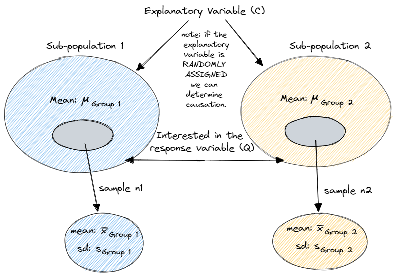

class:title-slide-custom

<style>
p.caption {
  font-size: 0.8em;
}
</style>

```{r, child = "style.Rmd"}
```


```{r setup, echo = FALSE, message = FALSE, warning = FALSE}

# Packages
library(emoji)
library(tidyverse)
library(gridExtra)
library(scales)
library(knitr)
library(kableExtra)
library(iconr)
library(fontawesome)
library(readr)
library(patchwork)

# R markdown options
knitr::opts_chunk$set(echo = FALSE, 
                      message = FALSE, 
                      warning = FALSE, 
                      cache = FALSE,
                      fig.align = 'center',
                      dpi = 300)
options(htmltools.dir.version = FALSE)
options(knitr.kable.NA = '')
```

```{r, include = F, eval = T, cache = F}
clean_file_name <- function(x) {
  basename(x) %>% str_remove("\\..*?$") %>% str_remove_all("[^[A-z0-9_]]")
}
img_modal <- function(src, alt = "", id = clean_file_name(src), other = "") {
  
  other_arg <- paste0("'", as.character(other), "'") %>%
    paste(names(other), ., sep = "=") %>%
    paste(collapse = " ")
  
  js <- glue::glue("<script>
        /* Get the modal*/
          var modal{id} = document.getElementById('modal{id}');
        /* Get the image and insert it inside the modal - use its 'alt' text as a caption*/
          var img{id} = document.getElementById('img{id}');
          var modalImg{id} = document.getElementById('imgmodal{id}');
          var captionText{id} = document.getElementById('caption{id}');
          img{id}.onclick = function(){{
            modal{id}.style.display = 'block';
            modalImg{id}.src = this.src;
            captionText{id}.innerHTML = this.alt;
          }}
          /* When the user clicks on the modalImg, close it*/
          modalImg{id}.onclick = function() {{
            modal{id}.style.display = 'none';
          }}
</script>")
  
  html <- glue::glue(
     " <!-- Trigger the Modal -->

<!-- The Modal -->
<div id='modal{id}' class='modal'>
  <!-- Modal Content (The Image) -->
  
  <!-- Modal Caption (Image Text) -->
  <div id='caption{id}' class='modal-caption'></div>
</div>
"
  )
  write(js, file = "js-addins.html", append = T)
  return(html)
}
# Clean the file out at the start of the compilation
write("", file = "js-addins.html")
```

<br><br>
# INTRODUCTION TO DATA & STATISTICAL INFERENCE
## Stat 218: Applied Statistics for the Life Sciences
### Dr. Robinson
#### California Polytechnic State University - San Luis Obispo
<!-- ##### `r fa("github", fill = "black")` [Course GitHub Webpage](https://earobinson95.github.io/stat218-calpoly) -->

---
class:inverse
# MONDAY, OCTOBER 17 2022

 Today we will...

+ Recap Two Independent Means from Reading

+ Activity 5: Cholesterol I

+ Question Time: Exam Review / Midterm Project Part 4

---
class:primary
# WHAT'S NEW?

.pull-left[
**Week 3**

+ ONE quantitative/numerical variable
+ Visualize with boxplots
+ Inference comparing the true mean to a "status quo" value

**Week 4**

+ TWO quantiative/numerical variables
+ Visualize with scatterplots
+ Inference comparing the slope / correlation to 0

].pull-right[
**Weeks 5 & 6**

+ ONE quantiative variable & ONE categorical variable
+ Visualize with side-by-side boxplots
+ Inference comparing the difference in means to 0
]

---
class:primary
# TWO INDEPENDENT MEANS

```{r, fig.cap = "", fig.alt = "", out.width = "70%"}

```

---
class:primary
# INFERENCE FOR TWO INDEPENDENT MEANS

**Parameter**

$\mu_{group 1} - \mu_{group 2}$: The true difference in mean *RESPONSE VARIABLE* between *GROUP 1* and *GROUP 2* for the population.

--

**Null:** The true difference in mean *RESPONSE VARIABLE* between *GROUP 1* and *GROUP 2* for the population is equal to 0 (There is no relationship between *EXPLANATORY* and *RESPONSE*.) $(H_O: \mu_{group 1} - \mu_{group 2} = 0)$


**Alternative:** The true difference in mean *RESPONSE VARIABLE* between *GROUP 1* and *GROUP 2* for the population is not equal to 0 (There is a relationship between *EXPLANATORY* and *RESPONSE*) $(H_A: \mu_{group 1} - \mu_{group 2} \ne 0)$


---
class:primary
# INFERENCE FOR TWO INDEPENDENT MEANS

Observed statistic: $\bar x_{Group 1} - \bar x_{Group 2}$

.pull-left[
**Randomization**

1. Write observed explanatory and response variables on the card.
2. Assume the null is true & "rip" the cards.
3. Simulate new groups, under the assumption is the null (permute/randomly match).
4. Calculate the summary statistic.
5. Draw a line at your observed statistic to calculate your p-value.

].pull-right[
**Theory**

+ Calculate your T-statistic using $$\frac{\text{Observed Statistic} - \text{Null Value}}{\text{SE}}.$$
+ Calculate the df as the smallest of $n_{\text{Group 1}} - 1$ and $n_{\text{Group 2}}-1.$
+ Compare your T-statistic to the $t_{df}$ distribution to calculate your p-value.

]

---
class: primary
# ACTIVITY 5: Cholesterol I

[Activity 5: Cholesterol I](https://earobinson95.github.io/stat218-calpoly/05-inference-for-two-means%2Bmidterm1/activity/activity5-cholesterol-I.html)

.center[
```{r, fig.cap = "", fig.alt = "", out.width = "50%"}
knitr::include_graphics("images/cornflake-vs-oatbran.cms")
```
]

---
class:primary
# TO DO

.pull-left[
+ Complete Activity 5: 
  + *check during class Monday, 10/24*
+ Midterm Project: Part 4
  + *Due Sunday, October 23 at 11:59pm*
  + **Do not** put this off
+ Study for Midterm Exam 1
  + In class next *Wednesday, 10/19*
  + Format & Practice Materials posted on Canvas

].pull-right[
**Office Hours This Week: 25-103**

+ Tuesday, 10/18 at 2:30pm - 4:30pm
+ Wednesday, 10/19 CANCELED
+ Thursday, 10/20 at 2:30pm - 3:30pm
]

---
class: inverse
# WEDNESDAY, OCTOBER 19, 2022

 Today we will...

+ Group Midterm 1 Exam (40 minutes)

+ Break (15 minutes)

+ Individual Midterm Exam (50 minutes)

---
class: primary
# GROUP EXAM

---
class: primary
# TAKE A BREAK

---
class: primary
# INDIVIDUAL EXAM

---
class:primary
# TO DO

+ Midterm Project: Part 4
  + *Due Sunday, October 23 at 11:59pm*
  + **Do not** put this off
+ Read Chapter 20 & 21
  + concept check *due Monday, October 24 at 2:10pm*


