class:title-slide-custom

<style>
p.caption {
  font-size: 0.8em;
}
</style>

```{r, child = "style.Rmd"}
```


```{r setup, echo = FALSE, message = FALSE, warning = FALSE}

# Packages
library(emoji)
library(tidyverse)
library(gridExtra)
library(scales)
library(knitr)
library(kableExtra)
library(iconr)
library(fontawesome)
library(readr)
library(patchwork)

# R markdown options
knitr::opts_chunk$set(echo = FALSE, 
                      message = FALSE, 
                      warning = FALSE, 
                      cache = FALSE,
                      fig.align = 'center',
                      dpi = 300)
options(htmltools.dir.version = FALSE)
options(knitr.kable.NA = '')
```

```{r, include = F, eval = T, cache = F}
clean_file_name <- function(x) {
  basename(x) %>% str_remove("\\..*?$") %>% str_remove_all("[^[A-z0-9_]]")
}
img_modal <- function(src, alt = "", id = clean_file_name(src), other = "") {
  
  other_arg <- paste0("'", as.character(other), "'") %>%
    paste(names(other), ., sep = "=") %>%
    paste(collapse = " ")
  
  js <- glue::glue("<script>
        /* Get the modal*/
          var modal{id} = document.getElementById('modal{id}');
        /* Get the image and insert it inside the modal - use its 'alt' text as a caption*/
          var img{id} = document.getElementById('img{id}');
          var modalImg{id} = document.getElementById('imgmodal{id}');
          var captionText{id} = document.getElementById('caption{id}');
          img{id}.onclick = function(){{
            modal{id}.style.display = 'block';
            modalImg{id}.src = this.src;
            captionText{id}.innerHTML = this.alt;
          }}
          /* When the user clicks on the modalImg, close it*/
          modalImg{id}.onclick = function() {{
            modal{id}.style.display = 'none';
          }}
</script>")
  
  html <- glue::glue(
     " <!-- Trigger the Modal -->

<!-- The Modal -->
<div id='modal{id}' class='modal'>
  <!-- Modal Content (The Image) -->
  
  <!-- Modal Caption (Image Text) -->
  <div id='caption{id}' class='modal-caption'></div>
</div>
"
  )
  write(js, file = "js-addins.html", append = T)
  return(html)
}
# Clean the file out at the start of the compilation
write("", file = "js-addins.html")
```

<br><br>
# Week 7: ANOVA + Categorical Variable EDA
## Stat 218: Applied Statistics for the Life Sciences
### Dr. Robinson
#### California Polytechnic State University - San Luis Obispo
<!-- ##### `r fa("github", fill = "black")` [Course GitHub Webpage](https://earobinson95.github.io/stat218-calpoly) -->

---
class:inverse
# MONDAY, OCTOBER 31 2022

 Today we will...

+ Recap Reading
+ Activity 7A: Introduction to ANOVA
+ Activity 7B: Hypothesis testing for ANOVA, Errors, and Multiple Comparison Procedures
+ Getting started on your final project

---
class:primary
# DECISION ERRORS

|                      | $H_0$ is True  | $H_0$ is False |
|----------------------|----------------|----------------|
| Reject $H_0$         | Type I Error   | Good Decision! |
| Fail to Reject $H_0$ | Good Decision! | Type II Error  |

---
class:primary
# WHAT'S DIFFERENT?

+ *Explanatory variable:* categorical
+ *Response variable:* quantitative
+ Visualize with side-by-side box-plots

.pull-left[

**Two Independent Means**

+ 2 Groups
+ Inference comparing the difference in group means to 0

].pull-right[

**AN**alysis **O**f **VA**riance (ANOVA)

+ 3+ Groups
+ Inference comparing the difference in group means to 0

*Special case: technically can do this with only 2 groups as well.*
]

---
class:primary
# INFERENCE FOR ANOVA

.pull-left[

**Null:** The population means for all groups are equal.

**Alternative:** At least one population mean differs.

].pull-right[

$H_O: \mu_\text{G1} = \mu_\text{G2} = \mu_\text{G3}=...=\mu_\text{Gk}$,

$H_A:$ At least one $\mu_{i}$ differs.

]

---
class:primary
# ANOVA

.center[
```{r, fig.cap = "", fig.alt = "", out.width = "80%"}
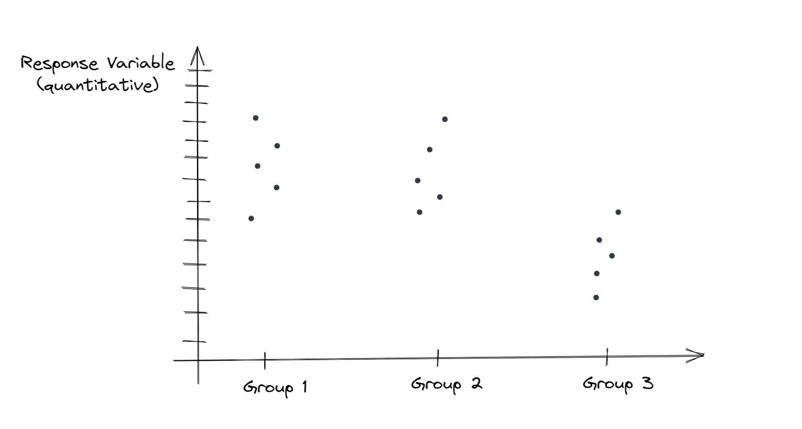
```
]

---
class:primary
# ANOVA

.center[
```{r, fig.cap = "", fig.alt = "", out.width = "80%"}
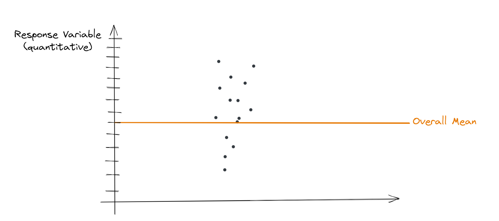
```
]

---
class:primary
# ANOVA

.center[
```{r, fig.cap = "", fig.alt = "", out.width = "80%"}
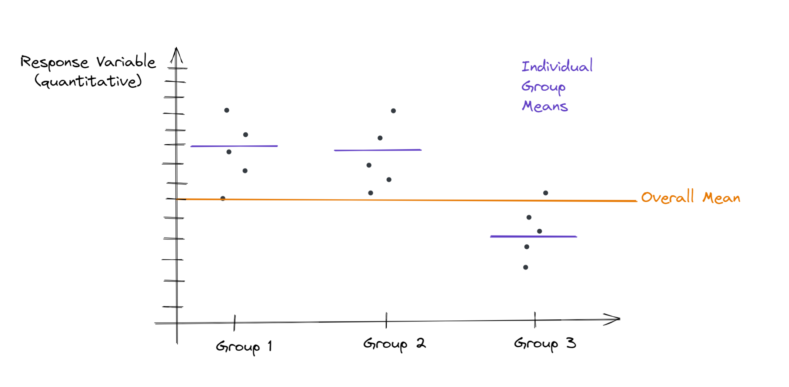
```
]

---
class:primary
# ANOVA

.center[
```{r, fig.cap = "", fig.alt = "", out.width = "80%"}
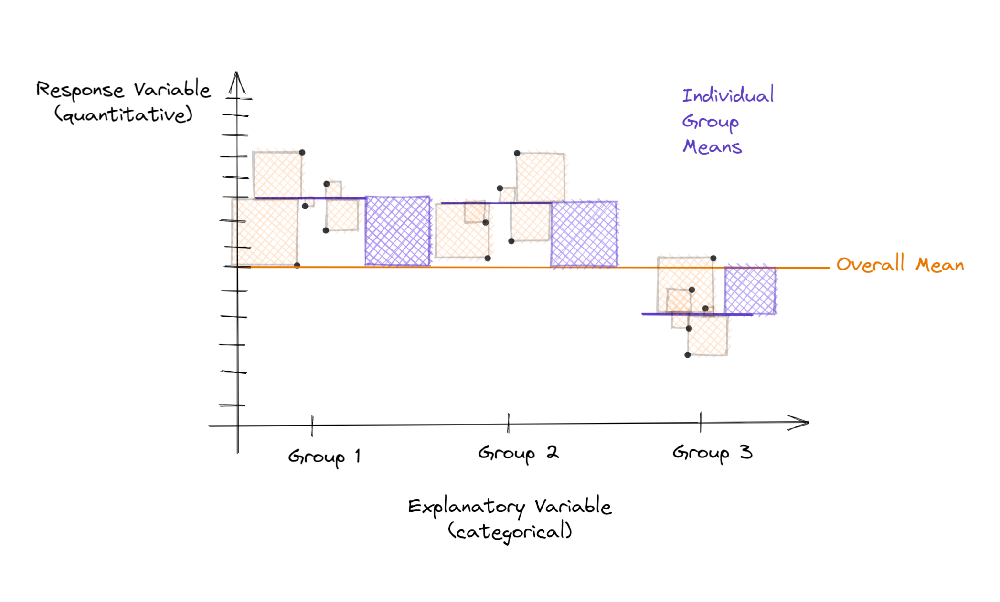
```
]

---
class:primary
# ANOVA

.center[
```{r, fig.cap = "", fig.alt = "", out.width = "80%"}
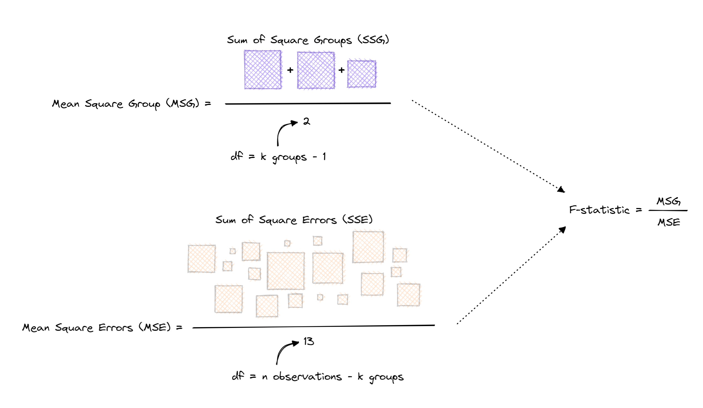
```
]

---
class:primary
# ANOVA

.center[
```{r, fig.cap = "", fig.alt = "", out.width = "80%"}
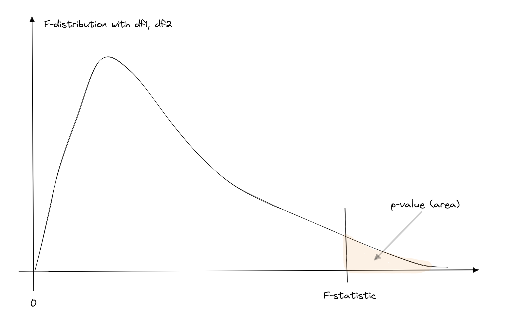
```
]

---
class: primary
# Activities 

[Activity 7A: Introduction to ANalysis Of VAriance](https://earobinson95.github.io/stat218-calpoly/07-anova-one-cat-eda/activity/intro-to-anova/activity7a-intro-to-anova.html)

[Activity 7B: Hypothesis Testing, Decision Errors, & Multiple Comparisons](https://earobinson95.github.io/stat218-calpoly/07-anova-one-cat-eda/activity/multiple-comparisons-procedure/activity7b-multiple-comparison-procedure.html)


.pull-left[
```{r, fig.cap = "", fig.alt = "", out.width = "40%"}
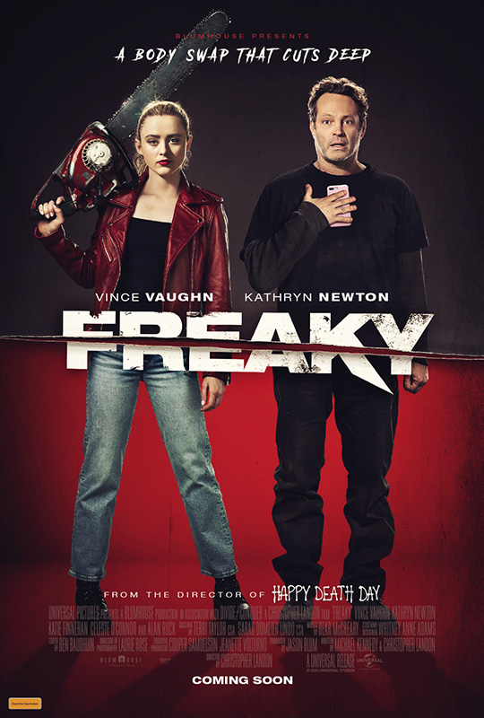
```
].pull-right[
```{r, fig.cap = "", fig.alt = "", out.width = "40%"}
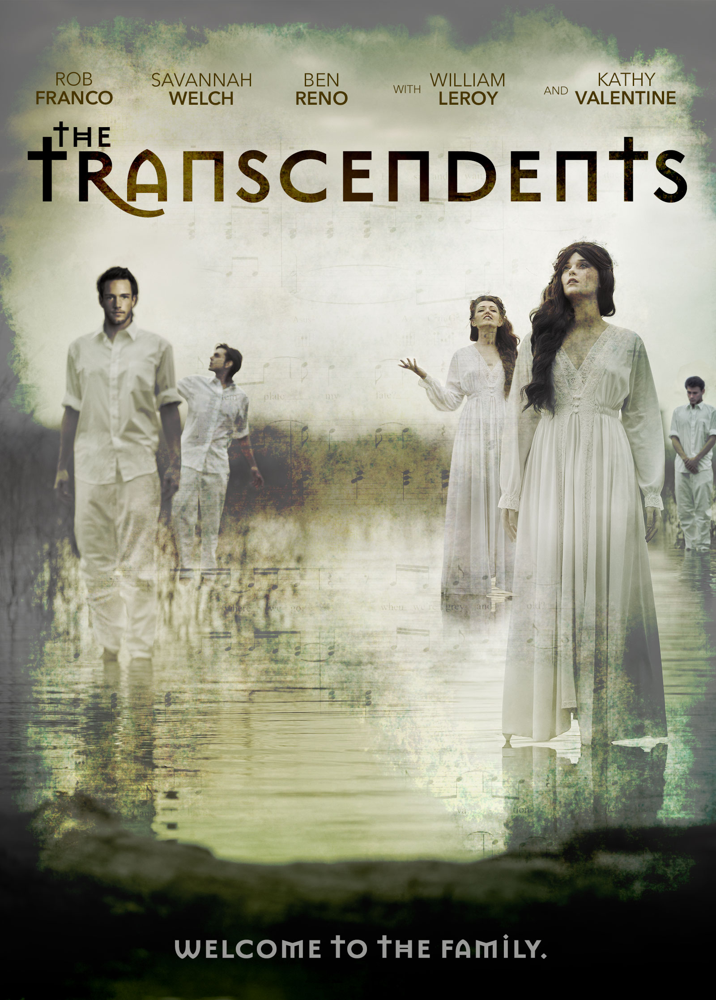
```
]

---
# Final Project

Your Final Project will focus on categorical variables, rather than the numerical variables that the Midterm Project focused on. 

[Example Final Project writeup](https://earobinson95.github.io/stat218-calpoly/07-anova-one-cat-eda/final_project/example-project/example_writeup_evals.html)

You will have time in class on Wednesday to work on this. You may want to wait until after Wednesday's lab to submit.

**Note: I have broken up the project steps further and made this step due this Sunday!**

---
class:primary
# TO DO

+ Complete Activity 7A: Introduction to ANOVA
  + *check during class Wednesday, 11/2*
+ Complete Activity 7B: Hypothesis Testing, Decision Errors, & Multiple Comparisons
  + *check during class Wednesday, 11/2*
+ Concept Check (Wednesdays)
  + *due Wednesday, 11/2 at 2:10pm*
+ Final Project: Step 1
  + *due Sunday, 11/6 at 11:59pm*

---
class: inverse
# WEDNESDAY, November 2, 2022

 Today we will...

+ Visualizing and Summarizing Categorical Variables
+ Check Activities 7A & 7B for Completion and Engagement
+ Lab 7: Categorical EDA
+ Final Project: Step 1

---
# Visualizing & Summarizing Categorical Variables

+ Categorical variables have levels / groups

+ Use a bar-plots to visualize frequencies

+ Use summary & contingency tables

+ Can compare **proportions** across groups

---
# One Categorical Variable

```{r, fig.cap = "", fig.alt = "", out.width = "70%"}
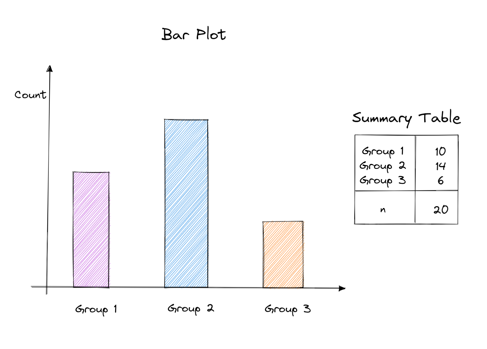
```

---
# Two Categorical Variables

```{r, fig.cap = "", fig.alt = "", out.width = "100%"}
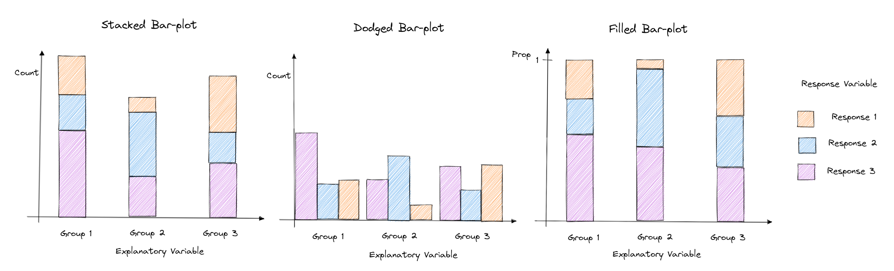
```

---
# Two Categorical Variables

```{r, fig.cap = "", fig.alt = "", out.width = "85%"}
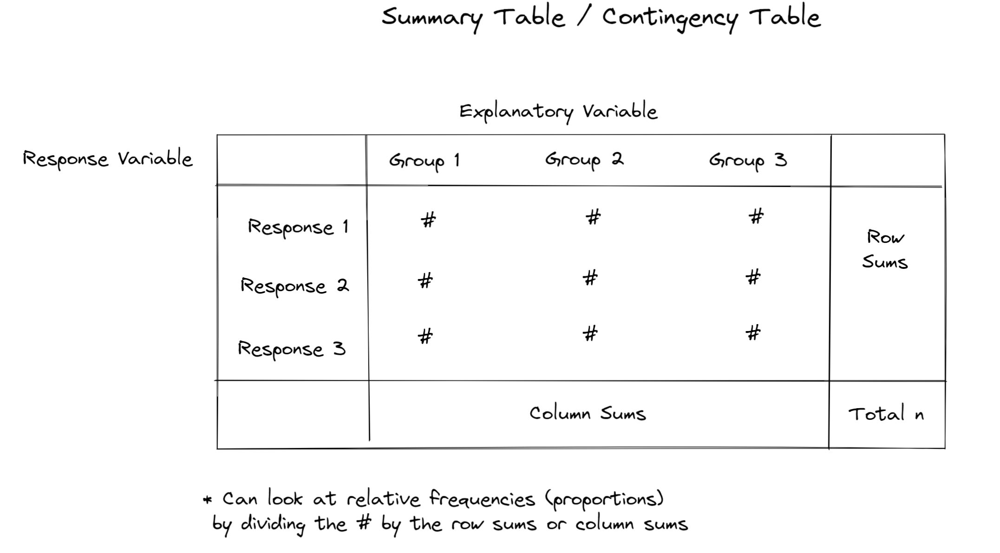
```

---
# Lab 7: Categorical EDA

[Lab 7: Categorical EDA](https://earobinson95.github.io/218-07-lab-categorical-eda/218-07-lab-categorical-eda.html)

```{r, fig.cap = "", fig.alt = "", out.width = "60%"}
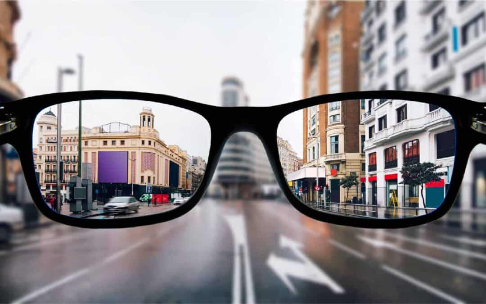
```

---
class:primary
# TO DO

+ **Lab 7: Categorical EDA**
  + Canvas Quiz & Completion turned in as groups
  + *Due Friday, November 4 at 11:59pm*
+ **Final Project: Step 1**
  + *Due Sunday, November 6 at 11:59pm*
+ **Read Grappling with "Statistical Significance" for Monday**
  + Reflection *due Monday, October 7 at 2:10pm*
+ **Begin studying for Midterm Exam 2**
  + *In class Wednesday, November 9*
  + See canvas for "what to expect" and question bank
  

