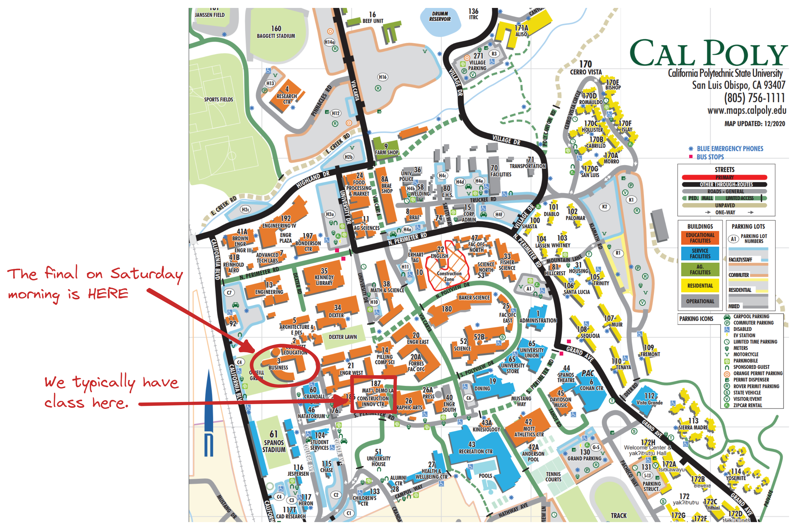

class:title-slide-custom

<style>
p.caption {
  font-size: 0.8em;
}
</style>

```{r, child = "style.Rmd"}
```


```{r setup, echo = FALSE, message = FALSE, warning = FALSE}

# Packages
library(emoji)
library(tidyverse)
library(gridExtra)
library(scales)
library(knitr)
library(kableExtra)
library(iconr)
library(fontawesome)
library(readr)
library(patchwork)

# R markdown options
knitr::opts_chunk$set(echo = FALSE, 
                      message = FALSE, 
                      warning = FALSE, 
                      cache = FALSE,
                      fig.align = 'center',
                      dpi = 300)
options(htmltools.dir.version = FALSE)
options(knitr.kable.NA = '')
```

```{r, include = F, eval = T, cache = F}
clean_file_name <- function(x) {
  basename(x) %>% str_remove("\\..*?$") %>% str_remove_all("[^[A-z0-9_]]")
}
img_modal <- function(src, alt = "", id = clean_file_name(src), other = "") {
  
  other_arg <- paste0("'", as.character(other), "'") %>%
    paste(names(other), ., sep = "=") %>%
    paste(collapse = " ")
  
  js <- glue::glue("<script>
        /* Get the modal*/
          var modal{id} = document.getElementById('modal{id}');
        /* Get the image and insert it inside the modal - use its 'alt' text as a caption*/
          var img{id} = document.getElementById('img{id}');
          var modalImg{id} = document.getElementById('imgmodal{id}');
          var captionText{id} = document.getElementById('caption{id}');
          img{id}.onclick = function(){{
            modal{id}.style.display = 'block';
            modalImg{id}.src = this.src;
            captionText{id}.innerHTML = this.alt;
          }}
          /* When the user clicks on the modalImg, close it*/
          modalImg{id}.onclick = function() {{
            modal{id}.style.display = 'none';
          }}
</script>")
  
  html <- glue::glue(
     " <!-- Trigger the Modal -->

<!-- The Modal -->
<div id='modal{id}' class='modal'>
  <!-- Modal Content (The Image) -->
  
  <!-- Modal Caption (Image Text) -->
  <div id='caption{id}' class='modal-caption'></div>
</div>
"
  )
  write(js, file = "js-addins.html", append = T)
  return(html)
}
# Clean the file out at the start of the compilation
write("", file = "js-addins.html")
```

<br><br>
# Week 10: Review + Final
## Stat 218: Applied Statistics for the Life Sciences
### Dr. Robinson
#### California Polytechnic State University - San Luis Obispo
<!-- ##### `r fa("github", fill = "black")` [Course GitHub Webpage](https://earobinson95.github.io/stat218-calpoly) -->

---
class:inverse
# MONDAY, NOVEMBER 27 2022

 Today we will...

+ What to Expect
+ KaHoot Review
+ 15-20 Minute Chat with Group mates (Submit Question to PearDeck)
+ Class Review

---
class:primary
# KaHoot Review

[KaHoot Review](https://create.kahoot.it/share/calpoly-stat218-final-review/14820896-a599-476f-8e5f-428ad63c9742)

---
class:primary
# Class Review

Take 15-20 minutes in your groups to come up with a well-thought out question about the question banks. This can be general or "can we talk about Q2b?"

Once your group has come up with their question, submit your question to the [PearDeck](https://docs.google.com/presentation/d/10Z1diVjbSPXOSKZjREmUyJqtRF3Id6NRm1CQO_N4qQE/edit?pli=1#slide=id.g1a29506486e_0_0) prompt.

---
class:primary
# TO DO

+ Final Project Submission (15% of your grade)
  + *Due Wednesday, November 30 at 11:59pm*
  + You will have time to finish this after the group exam on Wednesday. You cannot ask questions or talk until after all groups have submitted their group exam.
  
+ Begin Studying for Final Exam
  + See question banks and what to expect on Canvas.

---
class: inverse
# WEDNESDAY, NOVEMBER 30, 2022

**Group Final Exam**

  + Group Canvas Assignment open the entire class period, but shouldn't take longer than an hour.
  + RStudio: *Section0X-Group-Final Exam*
  + Closed-book, closed-note, closed-internet (besides Rstudio and Canvas for accessing & turning in)
  + Return R note cards to front of room when done
  
**Final Project Submission** (15 % of your grade)

+ Please quietly work on this until all groups have submitted their group final.

***DO NOT LEAVE CLASS EARLY UNLESS YOU HAVE SUBMITTED YOUR FINAL PROJECT***

---
class:primary
# TO DO

.pull-left[
+ Final Project Submission (15% of your grade)
  + *Due TONIGHT, November 30 at 11:59pm*
+ Individual Final Exam
  + Saturday, December 3 from 10:10am - 1pm
  + Business 003-0111/0112
].pull-right[

```{r}

```
]